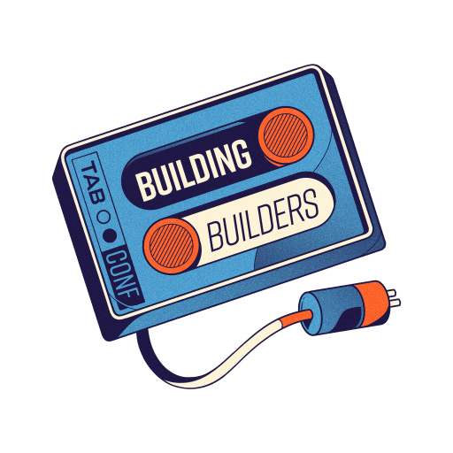

# Builder Days

Builder Days is our version of a laid back co working and a hackathon. Its purpose is to educate and onboard developers to different open source/ FOSS Bitcoin projects. Participating bitcoin FOSS projects will run programming at their own tables. As a participant, you get to pick your favorite project to hang out with and learn from.

## Attendees can expect to learn a lot!

- What is the project
- Why is it important
- How does it benefit Bitcoin
- How can you setup a dev environment to leverage the tools
- How to contribute for the first time to the project
- Above all else, Builder Days attendees can get all of their questions answered about their favorite projects straight from the source!

If you want to run a Builder Days table for your FOSS Bitcoin project, you can [open a GitHub issue!](https://github.com/TABConf/2023.tabconf.com/issues/new?assignees=&labels=Builder+Day+Project&template=builder-day-project-submission.md&title=)!

## Builder Days Sponsor

## Projects we had in 2022:

- Bitcoin Dev Kit (BDK)
- Lightning Dev Kit (LDK)
- FediMint
- Core Lightning
- Bitcoin Design
- Hands-On Simplicity
- Lily Wallet
- SuredBits
