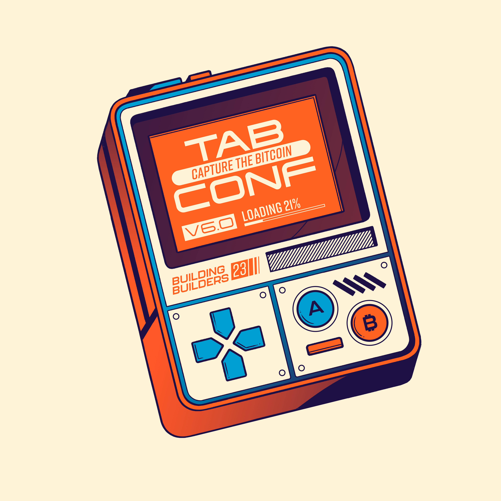
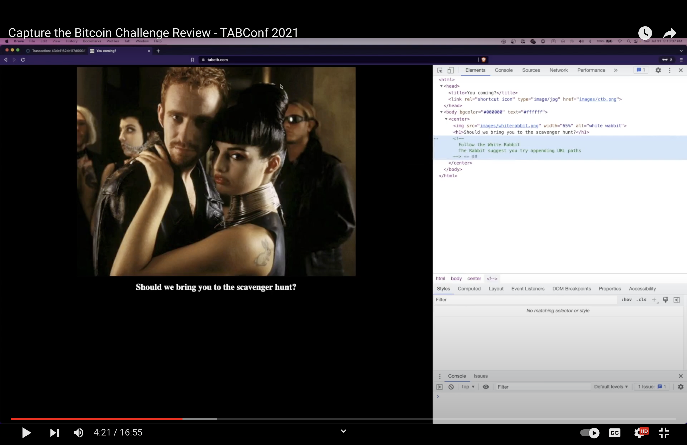

# Capture the Bitcoin Challenge (CTB)

TABConf 2023 is bringing back the CTB challenge for its third year! 

This scavenger hunt will test your knowledge of Bitcoin and challenge you to think creatively.

Join in on the fun and make new friends while learning something new. The ultimate goal is to be the first to snatch the bitcoin from a specific UTXO.

🎁 To get started, simply attend TABConf and pick up your challenge coin at the entrance.

🔎 The first clue can be found on the back of the copper coin, or you can opt for the silver challenge coin, available for purchase on the registration page. 

🪙 The silver coin doesn't give you any advantage in the game, but it sure looks cool to have a 1 ounce, 0.999 fine silver coin.

That’s it!

### Watch the 2021 CTB Recap Video below 👇

