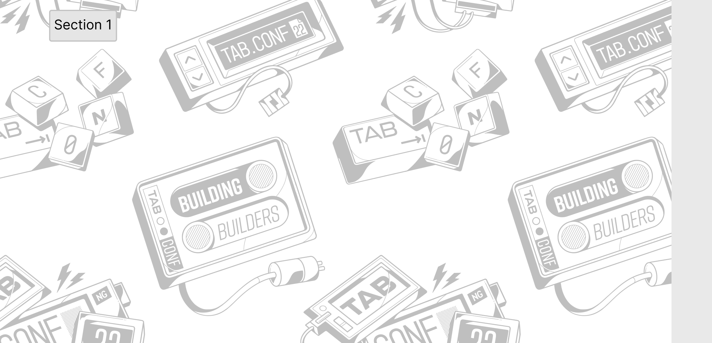

<a></a>

At TABConf, we bring together the best and brightest minds in the bitcoin world to share their insights, knowledge, and experience about the latest developments. From seasoned core devs to up-and-coming plebs, TABConf is the perfect place to connect with like-minded individuals and learning from the experts.

Don't miss out on your chance to be a part of TABConf 2023. Join us in Atlanta, and we will make some magic happen! 🤘

```sh
  # Script
  <'TABConf 2023'> <'grassroots, inclusive'> OP_CAT
  <'bitcoiners, developers, '> OP_CAT
  <'researchers, entrepreneurs, students, curious people'> OP_CAT
  <'bitcoin, workshops, talks, villages, hacker space'> OP_CAT
  <'September 6th - 9th, 2023'> OP_CAT
  <'Atlanta, GA USA'> OP_CAT
  <'Building Builders'> OP_CAT
  <'Buy Your Ticket'> OP_CAT
  OP_HASH160
  <0x1867386612b8d16e704c1dc8dcf7e43fcd20871a> OP_EQUAL
  <2022> OP_ADD
  <2023> OP_EQUAL
```

## 4 Days of Building 🏗️

<details>
<summary>
Builder Days 🔨  
</summary>
  
Builder's Day is an opportunity to learn how to contribute to open-source projects in the Bitcoin. If you're interested in becoming a developer in the bitcoin industry, this day is not to be missed.
</details>

*** 

<details>
<summary>
Workshops 💻
</summary>

  Workshops at TABConf are developer-focused and offer the chance to learn from experts in the field.

</details>

*** 

<details>
<summary>
Villages 🏘️
</summary>

  The conference will also feature villages: the Bitdevs Socratic village, PlebDev Village, and the Shadowy Super Coders & Gamers Village.

</details>

*** 

<details>
<summary>
Capture the Bitcoin (CTB) 🕵️
</summary>

  The TABConf CTB scavenger hunt will test your knowledge of Bitcoin as you compete to be the first to steal real Bitcoin!

</details>

*** 

<details>
<summary>
Chess Tournament ♟️
</summary>

  The chess tournament has a 100k sats buy-in and is a single-round elimination for winners.

</details>

*** 

<details>
<summary>
Afterparties 🪅
</summary>

  Afterparties sponsored by ZEBEDEEE in the Shadowy Super Coders & Gamers Village and are always open to all attendees. Don't miss out on the fun!

</details>

*** 
