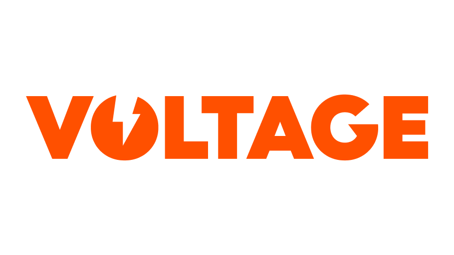
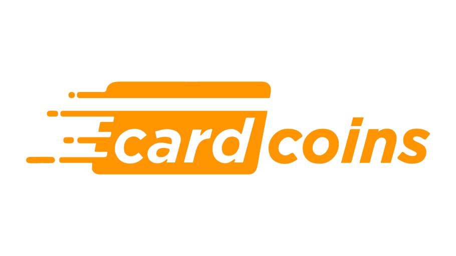
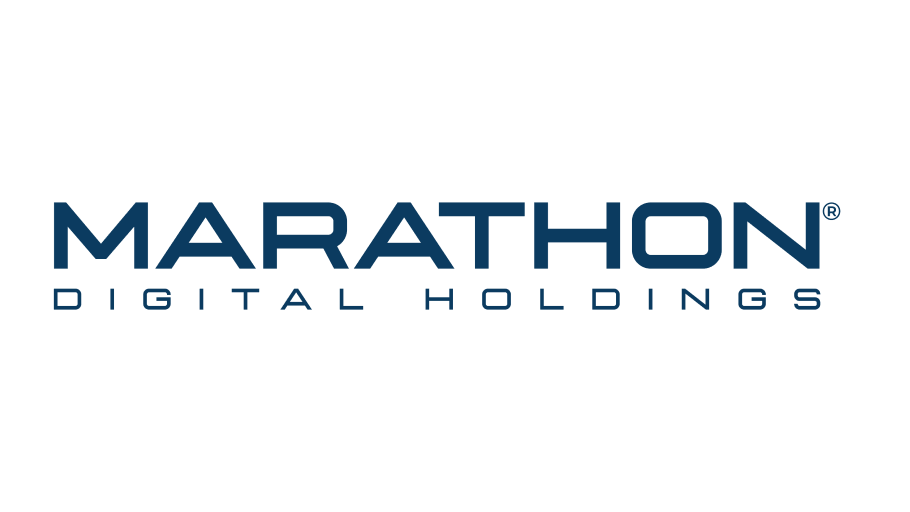
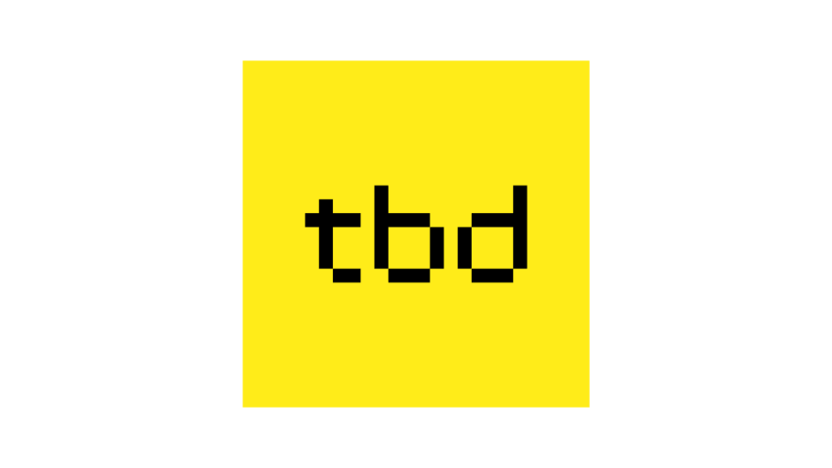
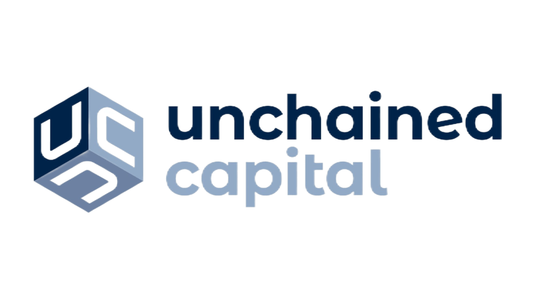
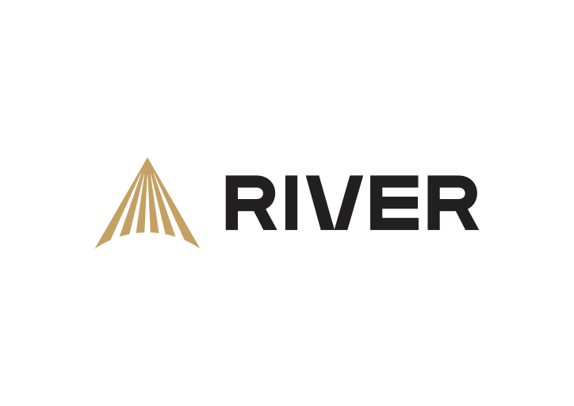
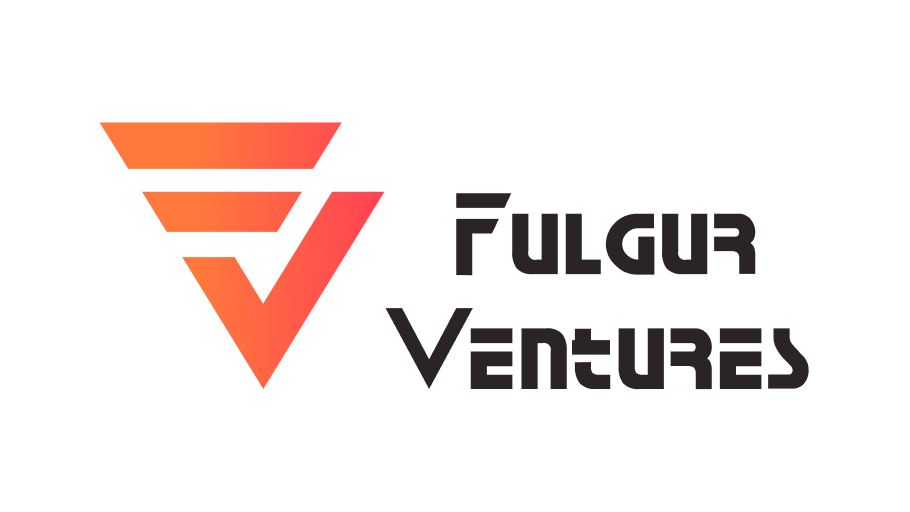
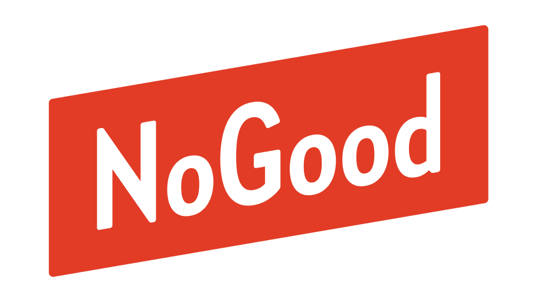
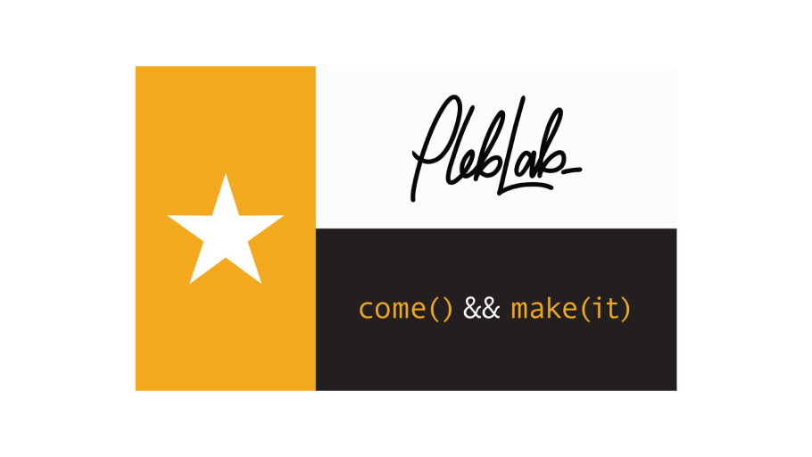
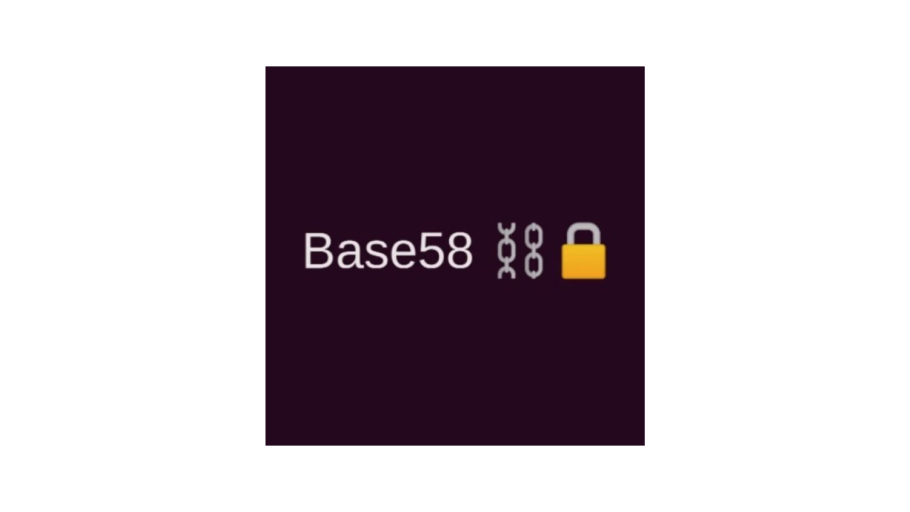

# Sponsors

Want to help us make the event possible, and get in front of the Bitcoin developer community? Read the [sponsor sheet](https://github.com/TABConf/2023.tabconf.com/blob/main/docs/sponsorsheet.md) and reach out to <hello@tabconf.com>.

## Main Stage Sponsor [🐦](https://twitter.com/voltage_cloud) [🌐](https://voltage.cloud/)

  
Run Lightning Instantly. Enterprise-grade infrastructure for the Lightning Network. Scalability should be as fast and as easy as Lightning itself.

***

## Builder Days Sponsor [🐦](https://twitter.com/_WolfNYC) [🌐](https://wolfnyc.com/)

 
Accelerating Lightning. The future of decentralized finance is being built today, and it's being built on Bitcoin and Lightning.

***

## Wristband Sponsor [🐦](https://twitter.com/sphinx_chat) [🌐](http://sphinx.chat/)

 
Decentralize social media, and take back your data.

***

## Bitcoin Development Fund Grant Sponsor [🐦](https://twitter.com/HRF) [🌐](https://hrf.org/devfund)

 
Human Rights Foundation launched a fund to support software developers who are making the Bitcoin network more private, decentralized, and resilient so that it can better serve as a financial tool for human rights activists, civil society organizations, and journalists around the world.

***

## Village Sponsor [🐦](https://twitter.com/CardCoinsCo) [🌐](https://www.cardcoins.co/)

 
Buy Cryptocurrency with Cash. Use a prepaid gift card to convert your cash into digital currency at over 80,000 locations nationwide.

***

## Village Sponsor [🐦](https://twitter.com/zebedeeio) [🌐](https://zebedee.io/)

 
Powering Real Economies In Virtual Worlds.

***

## Coffee Sponsor [🐦](https://twitter.com/MarathonDH) [🌐](http://www.mara.com/)

 
Marathon Digital Holdings is building one of the largest bitcoin mining operations in North America.

***

## Grant Sponsor [🐦](https://twitter.com/fedibtc) [🌐](https://www.fedi.xyz/)

 
Fedi builds global Bitcoin adoption technology. Billions of people are unable to hold bitcoin on or off exchanges. Fedi, powered by Fedimint, allows anyone to use Bitcoin easily, securely, and collaboratively.

***

## Lunch Sponsor [🐦](https://twitter.com/TBD54566975) [🌐](https://www.tbd.website/)

 
TBD Makes the decentralized financial world accessible – for everyone.

***

## Lunch Sponsor [🐦](https://twitter.com/layertwolabs) [🌐](https://layertwolabs.com/)

 
Our Goal - To make every transaction a Bitcoin txn. Drivechains — How we accomplish this.

***

## General Sponsor [🐦](https://twitter.com/Strike) [🌐](https://strike.me/)

 
A more connected financial world send and receive money instantly. Buy bitcoin. Get paid in bitcoin.

***

## General Sponsor [🐦](https://twitter.com/Start9Labs) [🌐](https://start9.com/)

 
Sovereign Computing. Eliminate the need for trusted third parties in the human/computer relationship. 

***

## General Sponsor [🐦](https://twitter.com/unchainedcap) [🌐](https://unchained.com/)

 
Securing your future. Bitcoin - Native Financial Services

***

## General Sponsor [🐦](https://twitter.com/River) [🌐](https://river.com/)

 
Build your Bitcoin wealth. Buy and mine Bitcoin with 100% full reserve custody, and zero fees on recurring orders.

***

## General Sponsor [🐦](https://twitter.com/mecee) [🌐](https://tvp.fund/)

 
Trammell Venture Partners is an Austin-based venture capital firm focused on investing in highly technical seed- and early-stage startups.

***

## General Sponsor [🐦](https://twitter.com/fulgurventures) [🌐](https://fulgur.ventures/)

 
Fulgur Ventures invest in early stage startups focused on Bitcoin and the Lightning Network.

***

## General Sponsor [🐦](https://twitter.com/paywithmoon) [🌐](https://paywithmoon.com/)

 
Moon is a platform that allows you to pay with crypto everywhere Visa® cards are accepted. Private. Secure. No fees.

***

## Community Sponsor [🐦](https://twitter.com/nogoodnode) [🌐](https://www.nogood.store/)

 
NoGood is an illustrated crew of tech-savvy street kids united by their obsession with electronics.

***

## Community Sponsor [🐦](https://twitter.com/PlebLab) [🌐](https://www.pleblab.com/)

 
PlebLab is a hackerspace and community accelerator located in Austin, Texas, we believe that collaboration and innovation are key to driving the growth and adoption of Bitcoin.

## Community Sponsor [🐦](https://twitter.com/base58btc) [🌐](https://base58.info/)

 
Base58⛓️🔓 is a Bitcoin protocol school. Our online and in-person courses are the perfect starting place for technical beginners looking to scratch the surface to even the most experienced devs looking to challenge themselves with a dive deep into the bitcoin protocol itself. 
