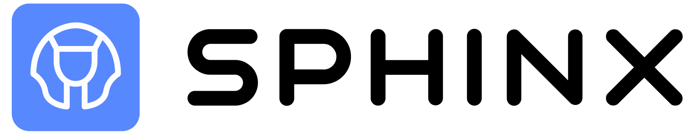
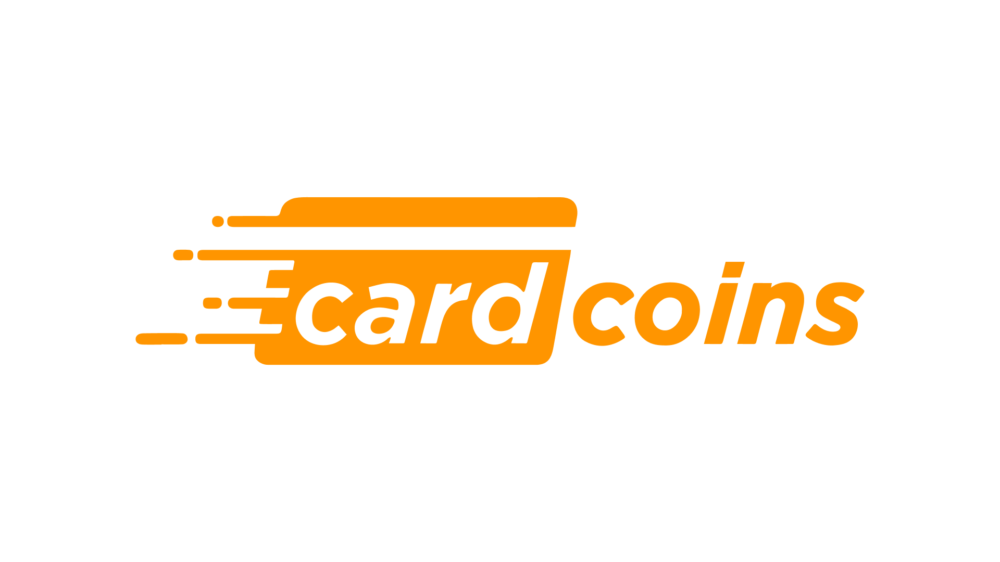
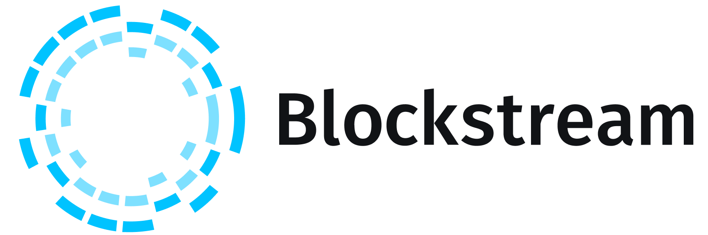
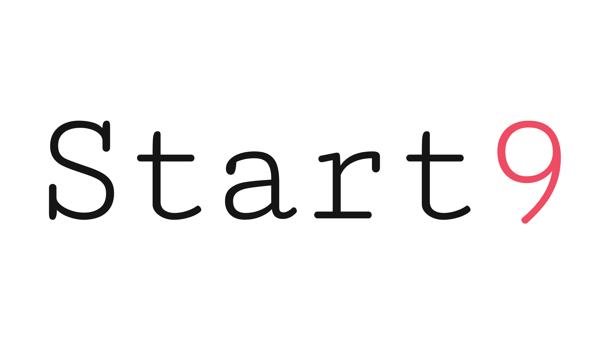
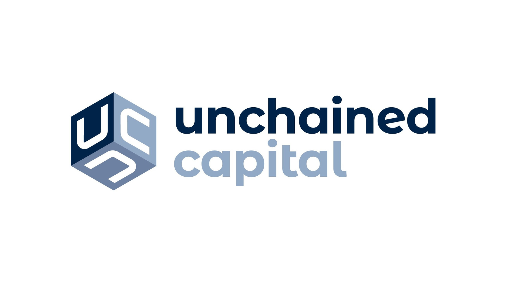

# 💰 Sponsors

## 🤔 Why Sponsor?
Because we need your money pls give it to us! tytytytyty

<h2 style="color: #FF9900; font-size: 40px"> <i> TITLE SPONSORS </i> </h2>

  

    <a>TW</a>
    <a>WEB</a>
  

  <button style="float:right; width: 166px;height: 35px;margin: 0 20px 10px 0;background: #FF9900;border: 2px solid #FF9900;border-radius: 30px;color:white;font-weight:bold">Mainstage Sponsor</button>
  
  
Voltage is an infrastructure provider for Bitcoin. We bring enterprise-grade services to both Layer 1 and Layer 2 technologies.
They bridge the gap between easy & fast cloud infrastructure and the security & privacy that Bitcoin requires.

